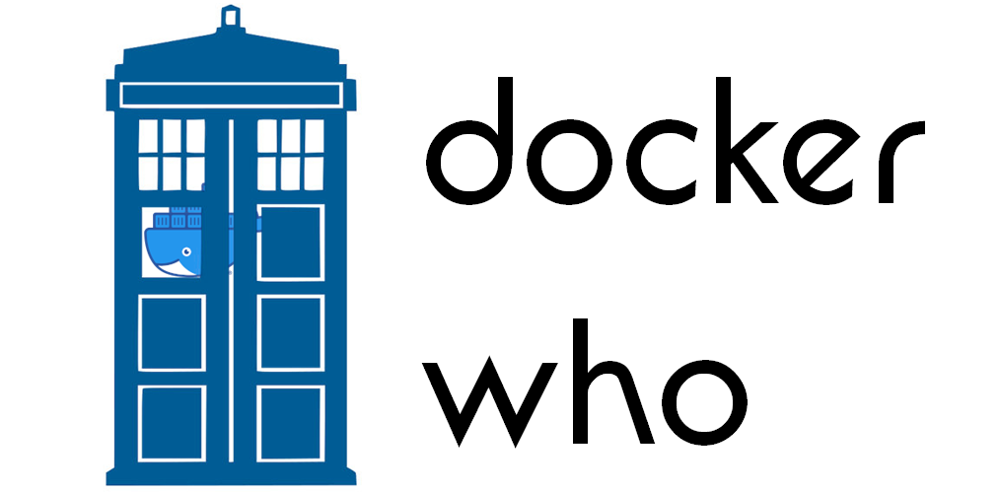

<p align="center"></p>

# Dockerwho <!-- omit in toc -->

- [Contributing](#contributing)
  - [Folder structure](#folder-structure)
  - [Docker tags / labels](#docker-tags--labels)
  - [Readme](#readme)
- [Auto-creation of Latest tags with GitHub actions](#auto-creation-of-latest-tags-with-github-actions)

A miscellaneous set of UMCCR dockerfiles that don't quite go anywhere else.    
This repo contains mostly containers used in our CWL pipelines.

## Contributing

### Folder structure

```text
repository-name
└── major.minor.patch
    ├── Dockerfile
    ├── Readme.md
    └── additional-file
```

where the docker image is tagged as `umccr/<repository-name>:major.minor.patch` (patch is optional).

### Docker tags / labels

Please lay out your LABEL attributes at the top of the Dockerfile with the following attributes

```dockerfile
LABEL author="your name" \
      description="A small description of the docker file" \
      maintainer="your@emailaddress.com"
```

### Readme

Complementing each Dockerfile should be a small Readme.md file.  

This should be a short document containing the following information.

1. Further resources:
  * Links to more online help for using this container.
  * Links to GitHub repositories that are used in this repo.
  * References to others when the dockerfile has been mostly inspired / derived from another source.
  
## Auto-creation of docker image with GitHub Actions

If your Dockerfile is pushed to the "main" branch, then it will be built and placed in the GitHub Container registry and
accessible via the [packages page](https://github.com/orgs/umccr/packages?repo_name=docker-who).  

By default packages are private but can be made public in each individual package setting.  

You can pull the docker image created via the following command:

```bash
docker pull ghcr.io/umccr/<package_name>:<package_version>
```

Docker images will only be updated if the versioned folder is updated.

## Auto-creation of "latest" tags with GitHub Actions 

The latest tag will be automatically created / updated on pushes to the 'main' branch 
if the version is the latest version for that package.   

## Selecting specific platforms to build

By default both `linux/amd64` and `linux/arm64` containers are built, however there may exist a situation where just one 
is appropriate. One can place a `config.yaml` file beside the image with a `platforms` key as a list. 

See [bcl-convert configuration file](https://github.com/umccr/docker-who/blob/main/repositories/bcl-convert/3.7.5/config.yaml) as an example.

## Removing 'untagged' versions.

Do not delete untagged versions of images as it will prevent [skopeo](https://github.com/containers/skopeo) from determining the manifest.  

If you have a lot of untagged versions, you may remove the package first and then re-push to trigger a fresh rebuild